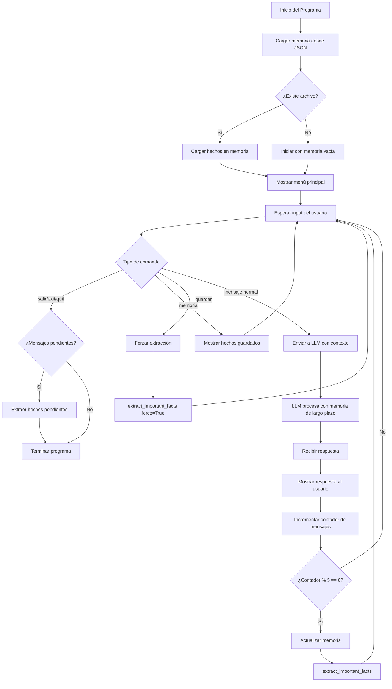
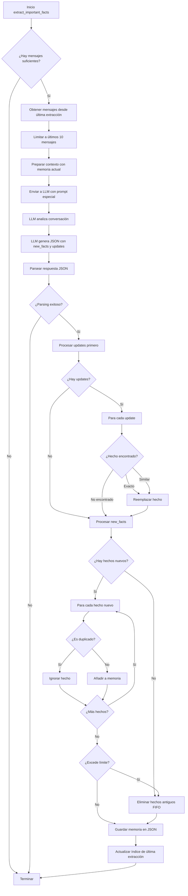
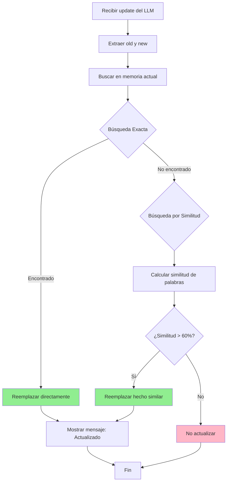
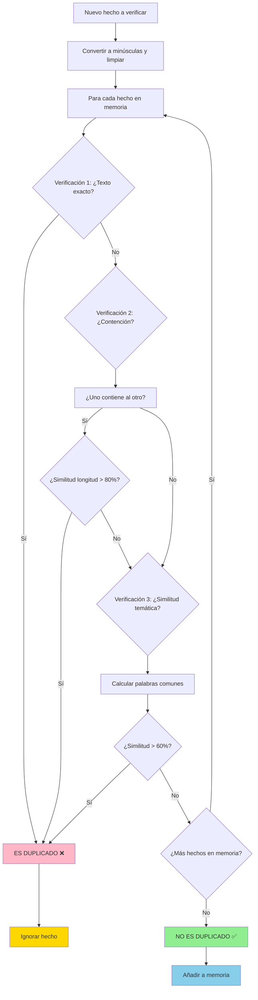
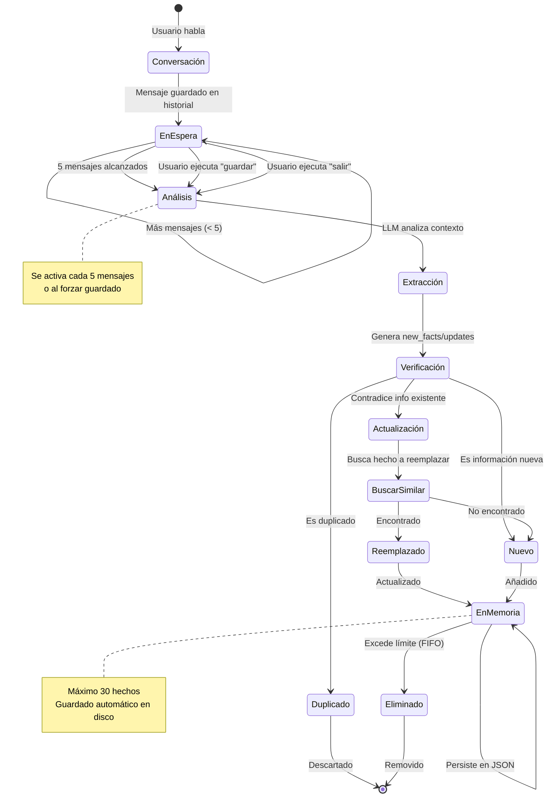

# Agente de IA con Memoria Semántica-Procedural de Largo Plazo

Un chatbot inteligente que utiliza **memoria de largo plazo persistente** para recordar información importante entre sesiones. El agente aprende automáticamente sobre ti, tus preferencias, y puede actualizar su conocimiento cuando la información cambia.

## 🌟 Características Principales

### 💾 Memoria Persistente
- **Almacenamiento en disco**: Los hechos importantes se guardan en formato JSON
- **Persistencia entre sesiones**: La memoria se mantiene aunque cierres y vuelvas a abrir el programa
- **Límite configurable**: Mantiene hasta 30 hechos importantes (configurable)

### 🧠 Extracción Inteligente de Hechos
- **Detección automática**: El LLM decide qué información es importante guardar
- **Extracción periódica**: Analiza la conversación cada 5 mensajes (configurable)
- **Evita duplicados**: Sistema de deduplicación automática
- **Actualización de información**: Detecta y actualiza hechos contradictorios

### 🔄 Sistema de Actualizaciones
- **Detección de cambios**: Identifica cuando la información nueva contradice la anterior
- **Reemplazo inteligente**: Actualiza hechos obsoletos automáticamente
- **Búsqueda por similitud**: Encuentra hechos relacionados aunque no coincidan exactamente

### ⚡ Eficiencia
- **Extracción periódica**: Solo actualiza memoria cada N mensajes, no en cada interacción
- **Guardado al salir**: Procesa mensajes pendientes antes de cerrar
- **Control manual**: Comando para forzar guardado cuando lo necesites

## 📋 Requisitos

- Python 3.7+
- Biblioteca `requests`
- API Key de OpenRouter (para acceder a modelos LLM)

## 🚀 Instalación

1. **Clona el repositorio o descarga el archivo**:
```bash
git clone <repository-url>
cd semantic-procedural-memory-ai-agent
```

2. **Instala las dependencias**:
```bash
pip install requests
```

3. **Configura tu API Key**:

Opción A - Variable de entorno (recomendado):
```bash
export OPENROUTER_API_KEY="tu-api-key-aqui"
```

Opción B - Editar el archivo:
```python
# En hello.py, línea 6
OPENROUTER_API_KEY = "tu-api-key-aqui"
```

## 💻 Uso

### Iniciar el programa

```bash
python hello.py
```

### Comandos disponibles

- **Conversar normalmente**: Simplemente escribe tus mensajes
- **`memoria`**: Muestra todos los hechos guardados en la memoria de largo plazo
- **`guardar`**: Fuerza la actualización inmediata de la memoria
- **`salir` / `exit` / `quit`**: Termina el programa (guarda memoria pendiente)

### Ejemplo de sesión

```
============================================================
Agente de IA con memoria semántica-procedural de largo plazo
============================================================
Hechos almacenados en memoria: 0
Extracción de memoria cada 5 mensajes
Escribe 'salir' o 'exit' para terminar.
Escribe 'memoria' para ver los hechos guardados.
Escribe 'guardar' para forzar guardado de memoria.

Tú: Hola, me llamo Juan y soy desarrollador de Python
Asistente: ¡Hola Juan! Encantado de conocerte. Es genial que seas desarrollador de Python...

Tú: Me encantan las películas de ciencia ficción
Asistente: ¡Excelente! La ciencia ficción es un género fascinante...

[Después de 5 mensajes...]
[Actualizando memoria... (5 mensajes)]
[Memoria: 2 nuevo(s) hecho(s) añadido(s)]

Tú: memoria

=== Memoria de Largo Plazo ===
1. El usuario se llama Juan
2. Es desarrollador de Python
3. Le encantan las películas de ciencia ficción

Total: 3/30 hechos
```

## 🔧 Configuración

Puedes personalizar el comportamiento editando estas constantes en `hello.py`:

```python
# Línea 19: Nombre del archivo de memoria
MEMORY_FILE = "long_term_memory.json"

# Línea 20: Número máximo de hechos a mantener
MAX_MEMORY_FACTS = 30  # Cambia a 50 si quieres más capacidad

# Línea 21: Frecuencia de extracción de memoria
EXTRACTION_INTERVAL = 5  # Cambia a 3 para actualizar más seguido
                         # o a 10 para actualizar menos seguido
```

## 📊 Diagramas de Funcionamiento

### Flujo General del Programa



### Proceso de Extracción de Memoria



### Sistema de Actualización de Hechos



### Proceso de Deduplicación



### Ciclo de Vida de un Hecho



## 🧪 Cómo Funciona

### 1. Memoria de Sesión vs Largo Plazo

**Memoria de Sesión** (`conversation_history`):
- Almacena toda la conversación actual
- Se borra al cerrar el programa
- Permite al LLM entender el contexto inmediato

**Memoria de Largo Plazo** (`long_term_memory`):
- Almacena solo hechos importantes
- Persiste en disco (`long_term_memory.json`)
- Se carga automáticamente al iniciar

### 2. Proceso de Extracción

```
Conversación (5 mensajes) → LLM Analiza → Extrae hechos importantes
                                        ↓
                          Verifica duplicados y contradicciones
                                        ↓
                            Actualiza/Añade a memoria
                                        ↓
                              Guarda en disco (JSON)
```

### 3. Sistema de Actualización

Cuando detecta información contradictoria:

```json
{
  "new_facts": [],
  "updates": [
    {
      "old": "Al usuario le gusta Python",
      "new": "Al usuario prefiere JavaScript"
    }
  ]
}
```

El sistema:
1. Busca el hecho antiguo en la memoria
2. Lo reemplaza con la nueva información
3. Mantiene la memoria actualizada y coherente

### 4. Deduplicación

Tres niveles de verificación:
- **Exacta**: Compara textos idénticos (ignorando mayúsculas)
- **Similitud alta**: Detecta hechos con >80% de contenido común
- **Similitud temática**: Encuentra hechos sobre el mismo tema (>60% palabras comunes)

## 📁 Estructura de Archivos

```
semantic-procedural-memory-ai-agent/
│
├── hello.py                    # Programa principal
├── long_term_memory.json       # Memoria persistente (se crea automáticamente)
└── README.md                   # Este archivo
```

## 🎯 Casos de Uso

### Asistente Personal
Recuerda tus preferencias, objetivos, y contexto personal para conversaciones más naturales.

### Tutor de Aprendizaje
Mantiene registro de lo que has aprendido, tus dificultades, y tu progreso.

### Organizador de Proyectos
Recuerda decisiones importantes, arquitectura elegida, y contexto del proyecto.

### Compañero de Brainstorming
Mantiene ideas importantes, conclusiones, y evolución de conceptos.

## 🔍 Tipos de Información que Guarda

El LLM está configurado para extraer:

✅ **Información personal**: Nombre, profesión, intereses, contexto
✅ **Preferencias**: Gustos, aversiones, estilos preferidos
✅ **Decisiones importantes**: Elecciones tomadas, conclusiones alcanzadas
✅ **Procedimientos aprendidos**: Métodos, técnicas, workflows
✅ **Objetivos**: Metas mencionadas, planes futuros
✅ **Relaciones**: Conexiones entre conceptos e ideas

❌ **NO guarda**: Saludos, conversación trivial, información temporal irrelevante

## ⚙️ Personalización del Modelo

Por defecto usa `x-ai/grok-4.1-fast`. Para cambiar el modelo:

```python
# Línea 218 en hello.py
data = {
    "model": "x-ai/grok-4.1-fast",  # Cambia aquí
    "messages": extraction_messages
}
```

Modelos recomendados para OpenRouter:
- `x-ai/grok-4.1-fast` - Rápido y eficiente
- `anthropic/claude-3-sonnet` - Muy preciso
- `openai/gpt-4` - Excelente comprensión

## 🐛 Solución de Problemas

### La memoria no se guarda
- Verifica que tengas permisos de escritura en el directorio
- Revisa que no haya errores en la consola
- Usa el comando `guardar` para forzar el guardado

### Se guardan hechos duplicados
- El sistema ya tiene deduplicación, pero puedes ajustar el threshold:
```python
# En is_duplicate_fact(), línea 112
if shorter / longer > 0.8:  # Cambia 0.8 a 0.9 para ser más estricto
```

### La memoria crece demasiado rápido
- Aumenta el `EXTRACTION_INTERVAL` (línea 21)
- Reduce el `MAX_MEMORY_FACTS` (línea 20)
- El prompt de extracción ya es selectivo

### No actualiza información contradictoria
- Verifica que el LLM esté detectando la contradicción
- Puedes ajustar el threshold de similitud:
```python
# En find_similar_fact(), línea 123
def find_similar_fact(new_fact, existing_facts, threshold=0.6):
    # Cambia 0.6 a 0.5 para ser menos estricto
```

## 📊 Formato del archivo JSON

El archivo `long_term_memory.json` tiene este formato:

```json
[
  "El usuario se llama Juan",
  "Es desarrollador de Python con 5 años de experiencia",
  "Prefiere programación funcional sobre orientada a objetos",
  "Le encantan las películas de ciencia ficción",
  "Está aprendiendo Rust"
]
```

Puedes editarlo manualmente si lo necesitas, pero asegúrate de mantener el formato de array JSON válido.

## 🤝 Contribuciones

Este es un proyecto educativo. Siéntete libre de:
- Hacer fork del repositorio
- Experimentar con diferentes prompts
- Añadir nuevas funcionalidades
- Probar diferentes modelos LLM

## 📝 Licencia

Este proyecto es de código abierto y está disponible para uso educativo y personal.

## 🙏 Créditos

- Utiliza la API de [OpenRouter](https://openrouter.ai/) para acceso a modelos LLM
- Modelo por defecto: Grok 4.1 Fast de xAI
